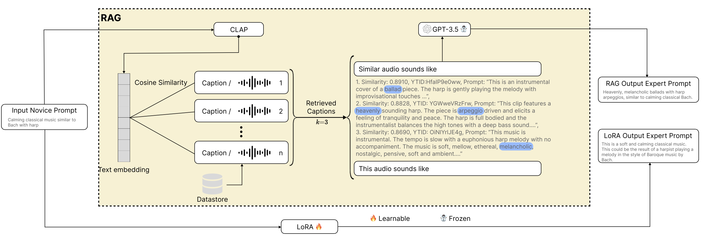
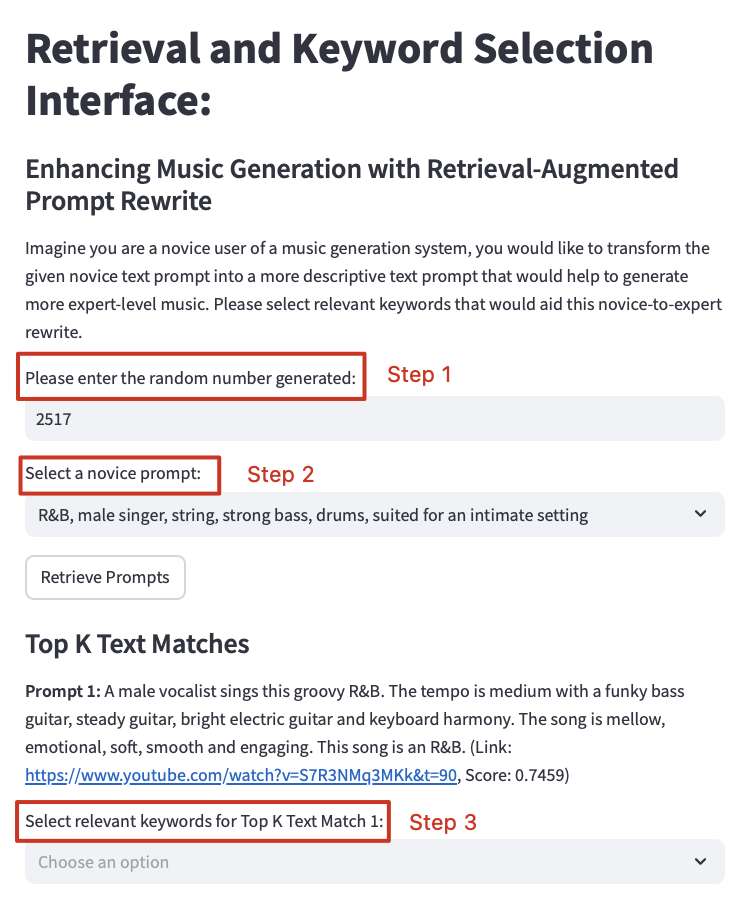

<center><h2>Enhancing Text-to-Music Generation through Retrieval-Augmented Prompt Rewrite</h2></center>

[**Dataset**](data) | [**Paper**]()

This repository contains the code and dataset used for the paper  
**"Enhancing Text-to-Music Generation through Retrieval-Augmented Prompt Rewrite."**

<p align="center">
  
</p>

This figure shows two novice-to-expert prompt rewrite methods:

1. **RAG** – A retrieval-augmented generation method that uses CLAP-based similarity to retrieve the top-$k=3$ most relevant audio captions. Participants select keywords (highlighted in blue) to guide GPT-3.5 in generating a custom expert-level prompt.

2. **LoRA** – A fine-tuned model for prompt rewriting.

---

## Quick Start

### 1. Environment Setup

Create and activate a conda environment:

```bash
conda create -n text2music python=3.10
conda activate text2music
```

Install the required dependencies:

```bash
pip install -r requirements.txt
```

### 2. Using the API

This project uses the OpenAI API. To enable it, create a `.env` file and add your API key:

```bash
echo "OPENAI_API_KEY=your_api_key_here" > .env
```

Replace `your_api_key_here` with your actual OpenAI API key.

### 3. Run the Streamlit App

Launch the app locally:

```bash
streamlit run scripts/streamlit_app.py
```

---

## Play with the Streamlit App

1. **Enter a Random Number**

   This is used as an anonymous identifier instead of your real name.

2. **Select a Novice Prompt**

   Choose one of the six novice prompts provided to begin the evaluation.

3. **Choose Relevant Keywords**

   For both the top-k text and audio matches, select the keywords you want to guide the expert prompt rewrite.

<p align="center">
  
</p>

---

## Survey Questions

Please respond to the following questions based on your evaluation experience:

1. **How familiar are you with the current genre under evaluation?**
   - No Experience
   - Little Experience
   - Moderate Experience
   - Extensive Experience

2. **Which version of the generated music sounds most like it was composed by an expert musician?**
   - Novice Generation  
   - LoRA Generation  
   - Retrieval-Augmented Generation

3. **Which version sounds the most musical (appropriate use of instruments, genre alignment, mood/emotion conveyance)?**
   - Novice Generation  
   - LoRA Generation  
   - Retrieval-Augmented Generation

4. **Which version sounds the most professional in terms of production quality (clarity, mixing, balance)?**
   - Novice Generation  
   - LoRA Generation  
   - Retrieval-Augmented Generation

5. **Which version of the music do you prefer overall?**
   - Novice Generation  
   - LoRA Generation  
   - Retrieval-Augmented Generation

6. **Did you notice any inconsistencies between the generated music and the corresponding text prompt?**
   - Novice Generation  
   - LoRA Generation  
   - Retrieval-Augmented Generation  
   - No noticeable issues (N/A)

7. **What is the random number generated at the beginning of your experiment?**  
   *(For anonymous tracking only; not used for identification.)*

8. **What is the ID of the current prompt under evaluation?**

