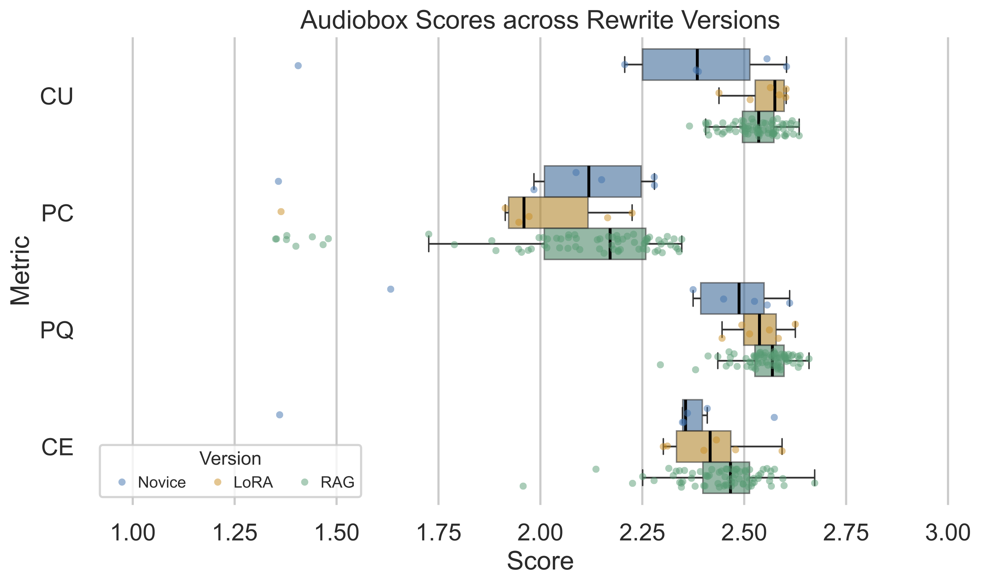
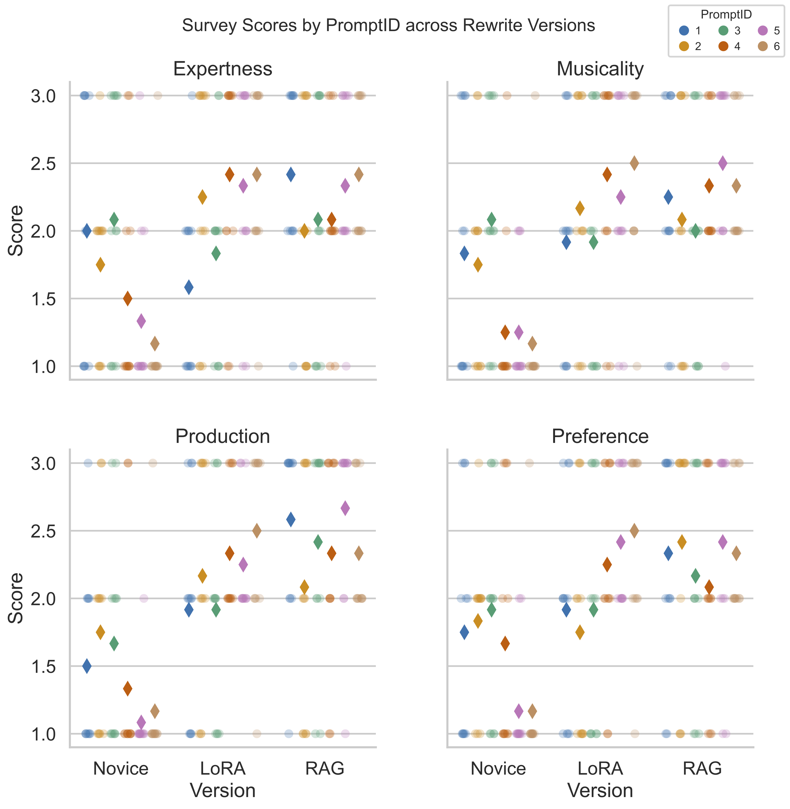

<center><h2>Enhancing Text-to-Music Generation through Retrieval-Augmented Prompt Rewrite</h2></center>

This repository contains the code and analysis used for the paper  
**"Enhancing Text-to-Music Generation through Retrieval-Augmented Prompt Rewrite."**

<p align="center">
  
</p>

This figure shows two novice-to-expert prompt rewrite methods:

1. **RAG** – A retrieval-augmented generation method that uses CLAP-based similarity to retrieve the top-$k=3$ most relevant audio captions. Participants select keywords (highlighted in blue) to guide GPT-3.5 in generating a custom expert-level prompt.

2. **LoRA** – A fine-tuned model for prompt rewriting.

## Dataset 

We used the [MusicCaps dataset](https://www.kaggle.com/datasets/googleai/musiccaps) introduced by Agostinelli et al. (2023) as the RAG datastore and as the basis for LoRA fine-tuning. Out of the 5,521 music samples—including 1,000 genre-balanced examples spanning 24 genres—we were able to download 5,353 for computing text and audio embeddings. Each entry has an aspect list detailing musical features (e.g., "pop, mellow piano, high-pitched vocal") and a musician-written caption describing the 10 second YouTube music track. To tackle the scarcity of novice-style music descriptions, we leveraged GPT-3.5 for MusicCaps prompt simplification by providing 24 novice-style examples, one per genre. With in-context learning, we generated a new set of novice captions, resulting in 5,521 novice-expert caption pairs for LoRA fine-tuning.

> Citation: Agostinelli, A., et al. (2023). *MusicLM: Generating Music From Text*. Google Research. [arXiv:2301.11325](https://arxiv.org/abs/2301.11325)

---

## Quick Start

### 1. Environment Setup

Create and activate a conda environment:

```bash
conda create -n ismir_text_rewrite python=3.10
conda activate ismir_text_rewrite
```

Install the required dependencies:

```bash
pip install -r requirements.txt
```

### 2. Run the Streamlit App

Launch the app locally:

```bash
streamlit run scripts/streamlit_app.py
```

---

## Play with the Streamlit App

1. **Enter a Random Number**

   This is used as an anonymous identifier instead of your real name.

2. **Select a Novice Prompt**

   Choose one of the six novice prompts provided to begin the evaluation.

3. **Choose Relevant Keywords**

   For both the top-k text and audio matches, select the keywords you want to guide the expert prompt rewrite.

<p align="center">
  
</p>

---

## Survey Questions

Please respond to the following questions based on your evaluation experience:

1. **How familiar are you with the current genre under evaluation?**
   - No Experience
   - Little Experience
   - Moderate Experience
   - Extensive Experience

2. **Which version of the generated music sounds most like it was composed by an expert musician?**
   - Novice Generation  
   - LoRA Generation  
   - Retrieval-Augmented Generation

3. **Which version sounds the most musical (appropriate use of instruments, genre alignment, mood/emotion conveyance)?**
   - Novice Generation  
   - LoRA Generation  
   - Retrieval-Augmented Generation

4. **Which version sounds the most professional in terms of production quality (clarity, mixing, balance)?**
   - Novice Generation  
   - LoRA Generation  
   - Retrieval-Augmented Generation

5. **Which version of the music do you prefer overall?**
   - Novice Generation  
   - LoRA Generation  
   - Retrieval-Augmented Generation

6. **Did you notice any inconsistencies between the generated music and the corresponding text prompt?**
   - Novice Generation  
   - LoRA Generation  
   - Retrieval-Augmented Generation  
   - No noticeable issues (N/A)

7. **What is the random number generated at the beginning of your experiment?**  
   *(For anonymous tracking only; not used for identification.)*

8. **What is the ID of the current prompt under evaluation?**

---
## Novice vs. LoRA v.s. RAG Prompts by Genre

| Prompt ID | Genre     | YouTube ID       | Novice Prompt                                                                                              | LoRA Rewrite | RAG Rewrite |
|-----------|-----------|------------------|-------------------------------------------------------------------------------------------------------------|--------------|-------------|
| 1         | R&B       | -6pcgdLfb_A      | R&B, male singer, string, strong bass, drums, suited for an intimate setting                               | A male singer performs an R&B song. This song is medium tempo with a string section and a strong bass line. The drums are playing a swing rhythm. The song is loud and ambient. The song is a bit noisy. This song is playing in a small room. | Create an R&B track with a male singer and female vocal, featuring a wide acoustic rhythm guitar melody, groovy bass line, drums, and string for an intimate setting. |
| 2         | Classical | -OUIEnuNd1I      | Calming classical music similar to Bach with harp                                                          | This is a soft and calming classical music. This could be the result of a harpist playing a melody in the style of Baroque music by Bach. | Create tranquil classical music reminiscent of Bach, featuring harp improvisation with delicate plucking. |
| 3         | Pop       | -rAhS48FkYw      | joyful pop song with passionate male vocal with shiny drum set sounds and wooden percussion                | A male singer performs an emotional and passionate pop song. The song starts with a wooden percussion and a shiny cymbal sound. The song then changes to an electric drum set. The first half of the song has a simple repetitive melody. The second half of the song is more complex and technologically advanced with various instruments and sounds. The overall mood of the song is joyful. | Create an upbeat pop track featuring a passionate male lead vocals, punchy guitar rhythm, punchy drumming, shiny drum set sounds, wooden percussion, synth backing, and background male vocals. |
| 4         | Soul      | 07xGXxIHOL4      | soul, romantic love song with lush saxophone, drum and piano accompaniment                                 | This is a soul song. The song is about romantic love and features a saxophone playing the melody. The song has a romantic quality to it. The song is a soul song and it features the song of a piano, drums and a bass playing the accompaniment. There is no other instrumentation in this song. | Craft a passionate and romantic love song featuring lush saxophone, piano, and drums, perfect for a relaxing live performance. Allow for improvisations and envision it as an ideal proposal song. |
| 5         | Indie     | 0H3FAoDgzhI      | indie song, female vocal, synth bass, industrial sound, medium fast                                        | This low quality audio contains an indie song that consists of a medium two bar female vocal, singing over synth bass, electric guitar chord, shimmering hi hats, crashing cymbals and ambient industrial sounds. | Create an indie song with echoing passionate female vocals, soft or mellow female vocals, a synth bass and industrial sound, complemented by a piano accompaniment. The tempo should be medium-fast, imbuing a sad and deep ambiance enhanced by reverb effects. |
| 6         | Jazz      | 8zcogfmAD_o      | classic New Orleans jazz, vintage swing feel, jazz orchestra with charming female talking intro           | This jazz clip features a live performance of a classic New Orleans jazz piece. The piece starts with a vintage jazz clarinet solo. The piece then shifts to an orchestra jazz piece. The first half of the piece has a vintage swing feel with a jazz orchestra playing the melody. There is a female voice in the background talking. The piece has a charming vibe. | Fast tempo jazz orchestra performance with vintage swing feel, featuring trombones, cheerful female talking intro, groovy bass lines, and upbeat energy. |

---
## Discussion

### Survey Score Distribution

<p align="center">
  
</p>

*Figure A1: Stacked bar plots showing the distribution of survey scores (1–3) across rewrite versions for each evaluation dimension. Mean scores of each version are annotated above each bar.*

RAG yields a higher proportion of top ratings (score = 3, shown in green) compared to LoRA and Novice prompts across all evaluation dimensions. For instance, in the musicality dimension, the average score increases from 1.56 (Novice) to 2.19 (LoRA), and further to 2.25 (RAG). While pairwise t-tests only assess statistical significance, OLS regression reveals that RAG consistently achieves larger effect sizes than LoRA.

### Audiobox Evaluation Scores

<p align="center">
  
</p>

*Figure A2: Audiobox evaluation scores (CU, PC, PQ, CE) for music generated using Novice, LoRA, and RAG prompts. Each point represents an individual audio clip's score; boxplots summarize distributions per rewrite method.*

Both RAG and LoRA outperform Novice generations for CU, PQ, and CE.

### Diffusion Randomness

<p align="center">
  
</p>

*Figure A3. Audiobox scores for music generated from the same Novice, LoRA, or RAG prompt (PromptID = 5).*

We did not explicitly model the variability inherent in diffusion process in the experiment (e.g., generating multiple musical outputs per prompt), but rather assumed minimal variation across outputs from the same text input. However, if we generate multiple audio for the same prompt in each group (here we take PromptID = 5 as an example), we can find the resulting rewrite groups' Audiobox scores has higher mean and lower variance than that of the Novice group in the CU, PQ, and CE dimensions, as shown in Figure A1, which aligns with our Audiobox Analysis results in Section 4.3. This indicates that the effectiveness of rewrite methods is robust to random fluctuations in diffusion-based generation. Higher average Audiobox scores show that rewrites better leverage the capabilities of the text-to-music model, and the lower variance in rewrite groups suggests more consistent outputs and improved handling of underspecified prompts.

Further comparison between the LoRA group with the RAG group reveals that RAG method better capture user intent. While LoRA-based rewrites reduced ambiguity by mimicking expert-style prompts from MusicCaps, rigid fine-tuning limit user control. In contrast, RAG embraces the one-to-many nature of the task: it retrieves multiple relevant candidate prompts and enables refinement through personalized keyword selection. This flexibility is also reflected in NLP metrics, where RAG achieves higher lexical diversity, greater textual complexity, and consistently higher BLEU scores than LoRA—indicating more specific, expert-level rewrites that better capture user intent. 

### Text-to-Music Consistency

To assess text-to-music consistency, as discussed in Q6, we computed the CLAP score for each audio and prompt pair. The 72 RAG prompt-audio pairs achieved the highest mean CLAP score (0.4987, sd=0.03), followed by 6 LoRA prompt-audio pairs (0.4621) and 6 Novice prompt-audio pairs (0.4266). However, this result contrasts with our survey Q6 responses, where LoRA received the highest inconsistency vote. This discrepancy could be caused by Stable Audio model’s difficulty in generating human vocals when prompted, which many participants identified as the source of inconsistency.

### Prompt-specific Variation

<p align="center">
  
</p>

*Figure A4. Survey scores (Questions 2-5) for four evaluation metrics for music generated using Novice Baseline, LoRA, RAG prompts across PromptIDs. Each circle represents a participant rating. Diamonds indicate the mean score for each rewrite method within each PromptID.*

This figure illustrates participant ratings for four evaluation metrics across three prompt versions when blocked by PromptID. Each circle represents an individual participant rating for a specific prompt (color-coded by PromptID, jittering used to avoid overlap between participant ratings and reveal the underlying density), while diamonds indicate the mean score for each version within each prompt. 

Overall, Novice prompts consistently receive the lowest scores across all metrics, while both rewrite methods show substantial improvement. Among the two, RAG generally achieves the higher mean ratings with less prompt-level variation. The tighter cluster of diamonds often near the top of the scale represents greater improvement and higher consistency. In contrast, LoRA improvements appear more prompt-dependent and is clustered more sparsely, as certain prompts (e.g., Prompt 4, 5 and 6, shown in red, brown and pink) show larger gains while others (e.g., Prompt 1, 2 and 3, shown in blue, yellow and green) exhibit smaller differences. This complements the results of Table 6, where LoRA's effect interacts more with PromptID. These patterns suggest that RAG method's improvement to music generation is more generalizable when individuals could tailor the rewrites.
